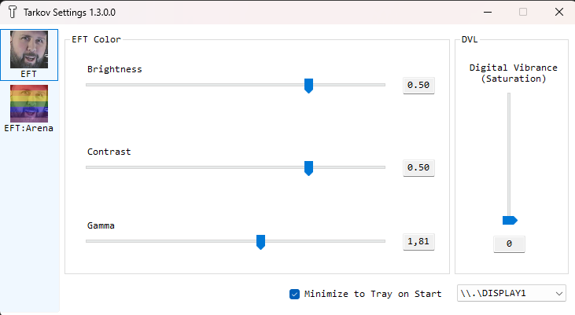

# tarkov-settings

## [->**DOWNLOAD Latest**<-](https://github.com/kayteckk/tarkov-settings/releases/latest)

Automatically change color settings for [Escape from Tarkov](https://escapefromtarkov.com) and Escape from Tarkov: Arena.

## Patch Notes

### 1.3.0
- Added separate color profiles for Escape from Tarkov and Escape from Tarkov: Arena.
- Reworked the side buttons: `EFT` edits the main game profile, and `EFT:Arena` edits the Arena profile.
- Applies the correct brightness, contrast, gamma, and saturation profile based on the focused game process.
- Stores settings in `%LOCALAPPDATA%\Tarkov Settings\settings.json` instead of the current working directory.
- Added Escape from Tarkov: Arena process detection.
- Modernized the project to SDK-style WinForms on .NET 8.
- Removed legacy `packages.config`, Fody/Costura, and old .NET Framework project config.

## How it works?
- Changes Digital Vibrance value from Nvidia Settings using [NvAPIWrapper](https://github.com/falahati/NvAPIWrapper)
- Changes Gamma using some [Win32 API calls](https://docs.microsoft.com/en-us/windows/win32/api/wingdi/nf-wingdi-setdevicegammaramp)

It only changes your display's colors when Escape from Tarkov or Escape from Tarkov: Arena is in focus.
This leaves a smooth transition when minimizing/maximizing.

## Supported Graphic Cards
- Nvidia GPU **fully supported.** (Brightness/Contrast/Gamma/Saturation)
- AMD GPU **partially supported.** (Except Saturation)
- **Intel/Etc is not supported yet.**

## What does it do?
You can change any of the following color settings:
1. Brightness
2. Contrast
3. Gamma
4. Digital Vibrance Control (aka. Saturation)
5. Separate profiles for EFT and EFT:Arena
6. Only affects display while EFT or EFT:Arena window is focused (It also prevents **sudden flash during Alt-tabbing**)

## How to Use
1. Open application (SmartGuard might prevent opening as it's not signed)
2. Choose `EFT` or `EFT:Arena` from the left side menu.
3. Set any color value for that game profile.
4. Double-click any slider labels to reset their values.
5. Minimize and play EFT or EFT:Arena.
6. Close application if you want to deactivate.

**Exit the app from your taskbar to create a `settings.json` file that will remember your settings**

## Warning
1. It might blink couple times when you active EFT window but it works. Don't worry.
2. **Disclaimer: I don't know BSG will ban for using this.**
3. AMD only supports Brightness/Contrast/Gamma Controls
4. Intel Graphic Cards are not supported
5. Only works in **Borderless mode.**
6. Nvidia Optimus Environment (mostly laptops) is not tested.

## TODO / Feature
- [x] Process Focusing Awareness
- [x] Digital Vibrance Value Change
- [x] Gamma Value Change
- [x] Brightness, Contrast, Gamma Value modify
- [x] GUI
- [x] ini or json configuration
- [x] Process Changeability (Not only for EscapeFromTarkov)
- [x] change display(monitor) target
- [x] Minimize to tray
- [x] Profiles
- [ ] Hot Keys
- [ ] EFT setting modify (Framelimit or Graphic Settings)

Thanks for your support!
